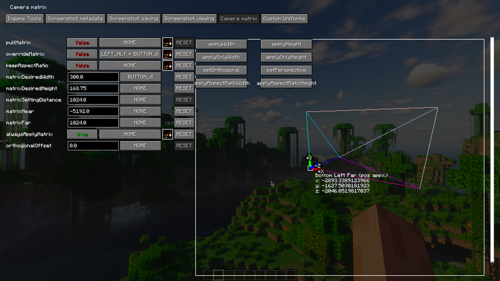
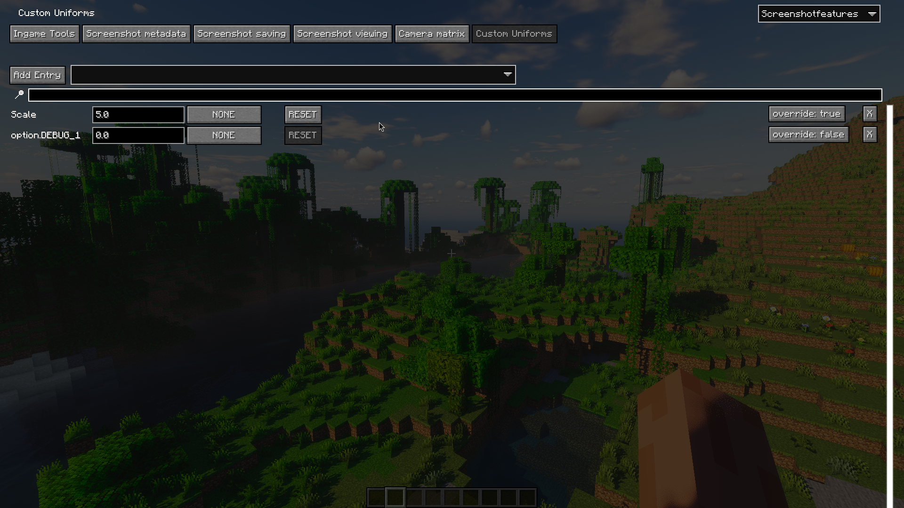

# Screenshot Features

**FEATURES DEPEND ON/CENTERED AROUND [IRIS](https://modrinth.com/mod/iris)**

**built for a somewhat technical/enthusiast shader screenshot taking audience**

if you have a niche need for something you think might help in your screenshot endeavors, make an issue on the [github](https://github.com/kidofcubes/screenshotfeatures)!

## mod features overview

- manually adjustable depth of field
- clientside time and weather
- saves metadata to screenshots
- - shaderpack settings
- - shaderpack hash and git status
- - location, time, fov, etc
- drag and drop appropriately tagged screenshots into the iris shaderpack list menu to load (the menu where you can see all your shaderpacks, not in the shaderpack settings!)
-
- ~~metadata saving compatible with fabrishot~~ waiting on fabrishot 26.2
- projection matrix editor (like using an orthographic projection)
- custom shader uniforms (requires editing shader files to use, more information down below)
- experimental runtime shader option changing (experimental, read more below)

the old features for screenshot folder and file managing will be reimplemented at some point, but have been left out for now

demo video (old, only shows dof feature) (chinese): https://www.bilibili.com/video/BV1MAYqzQEAp/


## ingame tools

dof lock lets you lock whatever your current focus distance is (made for using with autofocus, for easy dof setting)

the weather/time settings *may* affect your local world when on singleplayer (at least, i remember i had this impression from somewhere), 
so these are locked behind another setting at the bottom of the page just in case


## ingame value editing

most numerical values in this mod have a keybind option next to them, which is its "modifier" key

when this modifier key is held, you can then press the increase value/decrease value keybinds to change the value incrementally
and optionally with another modifier as well, to scale up/down your change of value 

(for my keybinds, I hold shift to make 0.1x adjustments, and ctrl to make 10x adjustments)

using the mouse scroll wheel for adjustments instead of the two separate increase/decrease keybinds is supported as well

(value editing settings are under Ingame Tools)


## metadata embedding

metadata is embedded as exif data on the png under the key `screenshotfeatures`, formatted in json
it can be viewed by parameter in the Screenshot Viewing tab by dragging a screenshot over it


## method of hashing

saves md5, sha256 and xxh32 hashes for enabled shader, git commit and diffs if it's a git repo

equivalent hashing of the folders in bash
```
cat $(find shaders -type f | sort) | xxh32sum
```

zip hashes are just hashes of the zip file for convenience

## projection matrix editor

this feature is in a pretty early stage, and is just barely working well enough to use
the controls are frankly terrible, but it may be interesting/helpful if you know what you're doing


enabling pull matrix pulls the values of the current projection matrix into the editor (the pulled value is pulled before the override),
but will not change the actual config values on the left

enabling keeping aspect ratio tries to scale the width/height respectively when you change the value of the other one
(i.e. if you had a width and height of 16 and 9 originally, and you set width to 32, height would be set to 18)

enabling always apply matrix constantly applies the values set in the configuration values to the matrix, (though only updates when you press enter in the text box/unfocus, not live per character)

clicking the buttons in the matrix viewer area is what actually applies the values you set in your config to the matrix! (unless always apply matrix is on)

override matrix actually applies the matrix to your player camera

orthogonal offset is a back and forth offset for the camera when you're using an orthogonal matrix,

### matrix tips

fiddling with the near/far plane numbers and the orthogonal offset is encouraged for dealing with shaders, 
(and remember that some shaders may just be irreparably (without great effort) broken when used with an orthogonal projection)
I use photon typically, which works *okay* with orthogonal (i have a few bugfixes for orthogonal projections for use with this mod in my personal fork of photon on my github)

typically, for orthogonal shader screenshotting, i use a 0 offset, -2048 near plane, and 1024 far plane, or something along these ratios/signs

note that if your width and your height fall out of ratio with each other relative to your window's size, things will appear squished!


## shader integration and custom uniforms

this mod defines `SCREENSHOT_FEATURES` when active, and provides a bool uniform named `isOrthogonalProjection`, 
which is set to true when the override matrix is enabled and the matrix is orthogonal



when a uniform is defined in the Custom Uniforms gui, it's added as a `float` uniform into the shader
and a `SCREENSHOT_FEATURES_CUSTOM_UNIFORM_{name}` define is added, enabling uses like:

```glsl
#ifdef SCREENSHOT_FEATURES

#ifdef DOF_INTENSITY
#ifdef SCREENSHOT_FEATURES_CUSTOM_UNIFORM_DOF_INTENSITY
#undef DOF_INTENSITY
uniform float DOF_INTENSITY;
#endif
#endif

#endif
```

where you can sort of "shadow" a shader setting with a uniform instead

theres an experimental "override" feature for this as well, which tries to basically do this automatically

internally, the override injects before and after the preprocessing stage for the shader, and removes the #define sharing the same
name as the uniform, and *attempts* to inline any const variables depending on it (which is the most sketchy part)

having override enabled uniforms will slow down shader compilation times


**bool uniform types are planned**

## planned features

(ones that i'm personally interested in at least)

- more control over chunk unloading/culling (for orthogonal screenshots/cameras at a far distance)
- some sort of system to automate taking a series of screenshots at different locations/angles for accurate comparisons
- supporting aperture (though I haven't asked ims for a build yet)
- optionally saving a depthmap of screenshots for better post processing capabilities

this mod isn't really meant to extend normal shader capability by providing more uniforms/textures/world data,
if I ever did that it would likely be in another mod

## credits
[older versions](https://github.com/kidofcubes/ScreenshotFeaturesOld) of this mod were based on [ScreenshotSettings](https://github.com/fmbellomy/ScreenshotSettings) by fmbellomy